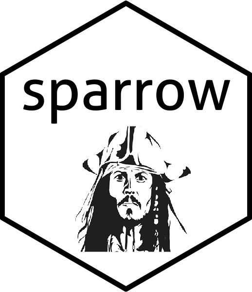
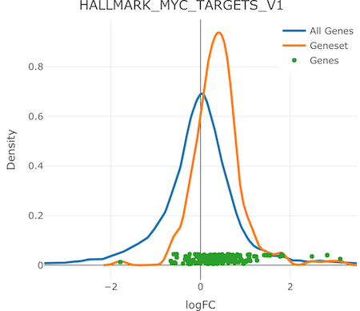

# sparrow 

<!-- badges: start -->

[](https://github.com/lianos/sparrow/actions)

[](https://www.repostatus.org/#active)
[](https://www.tidyverse.org/lifecycle/#stable)
[](https://codecov.io/gh/lianos/sparrow)
<!-- badges: end -->

`sparrow` was built to facilitate the use of gene sets in the analysis
of high throughput genomics data (primarily RNA-seq). Analysts can
orchestrate any number of GSEA methods across a specific contrast using
the unified interface provided by the `seas`. A shiny application is
provided via the
[sparrow.shiny](https://github.com/lianos/sparrow.shiny) package that
enables the interactive exploration of of GSEA results.

-   The `seas` function is a wrapper that orchestrates the execution of
    any number of user-specified gene set enrichment analyses (GSEA)
    over a particular experimental contrast of interest. This will
    create a `SparrowResult` object which stores the results of each
    GSEA method internally, allowing for easy query and retrieval.

-   A sister [sparrow.shiny](https://github.com/lianos/sparrow.shiny)
    package provides an `explore` function, which is invoked on
    `SparrowResult` objects returned from a call to `seas()`. The shiny
    application facilitates interactive exploration of these GSEA
    results. This application can also be deployed to a shiny server and
    can be initialized by uploading a serialized `SparrowResult` `*.rds`
    file.

Full details that outline the use of this software package is provided
in the [package’s
vignette](https://lianos.github.io/sparrow/articles/sparrow.html),
however a brief description is outlined below.

## Usage

A subset of the RNA-seq data tumor/normal samples in the BRCA indication
from the TCGA are provided in this package. We will use that data to
perform a “camera” and “fry” gene set enrichment analysis of tumor vs
normal samples using the MSigDB hallmark gene set collection with
`sparrow::seas()`.

``` r
library(sparrow)
library(dplyr)
bsc <- getMSigCollection('H', species = 'human', id.type = "entrez")
vm <- exampleExpressionSet(dataset = 'tumor-vs-normal', do.voom = TRUE)
mg <- seas(vm, bsc, c("cameraPR", "fry"), design = vm$design, contrast = "tumor")
```

We can view the top “camera” results with the smallest pvalues like so:

``` r
results(mg, "cameraPR") %>%
  arrange(pval) %>%
  select(name, padj) %>%
  head
#>                        name         padj
#> 1      HALLMARK_E2F_TARGETS 4.303158e-21
#> 2   HALLMARK_G2M_CHECKPOINT 5.412503e-16
#> 3   HALLMARK_MYC_TARGETS_V1 8.642770e-10
#> 4 HALLMARK_MTORC1_SIGNALING 3.170023e-07
#> 5       HALLMARK_MYOGENESIS 3.402614e-06
#> 6   HALLMARK_UV_RESPONSE_DN 6.624519e-06
```

The shift in expression of the genes within the top gene set can be
visualized with the `iplot` function below. This plot produces
interactive graphics, but rasterized versions are saved for use with
this `README` file:

``` r
iplot(mg, 'HALLMARK_MYC_TARGETS_V1', type = "density")
```



``` r
iplot(mg, 'HALLMARK_MYC_TARGETS_V1', type = "gsea")
```


When these plots are rendered in your workspace or an Rmarkdown
document, the user can hover of the genes (dots) to see their name and
differential expression statistics.

For an immersive, interactive way to explore the GSEA results, use the
`sparrow.shiny::explore(mg)` method!

## Installation

This is the development version of the R/bioconductor package
`{sparrow}`. It may contain unstable or untested new features. If you
are looking for the release version of this package please go to its
official Bioconductor landing page and follow the instructions there to
install it.

You can install this development version using the `{BiocManager}` CRAN
package:

``` r
BiocManager::install("sparrow", version = "devel")
```

Alternatively, you can install it from GitHub using the `{remotes}`
package.

``` r
remotes::install_github("lianos/sparrow")
```

To install the shiny bits for this package, you can install the
`{sparrow.shiny}` in a similar way as described above.

## Historical Note

This package used to be called
[multiGSEA](https://github.com/lianos/multiGSEA)), but it’s name was
changed to avoid conflict with another package by the same name that was
submitted to Bioconductor version 3.12.
