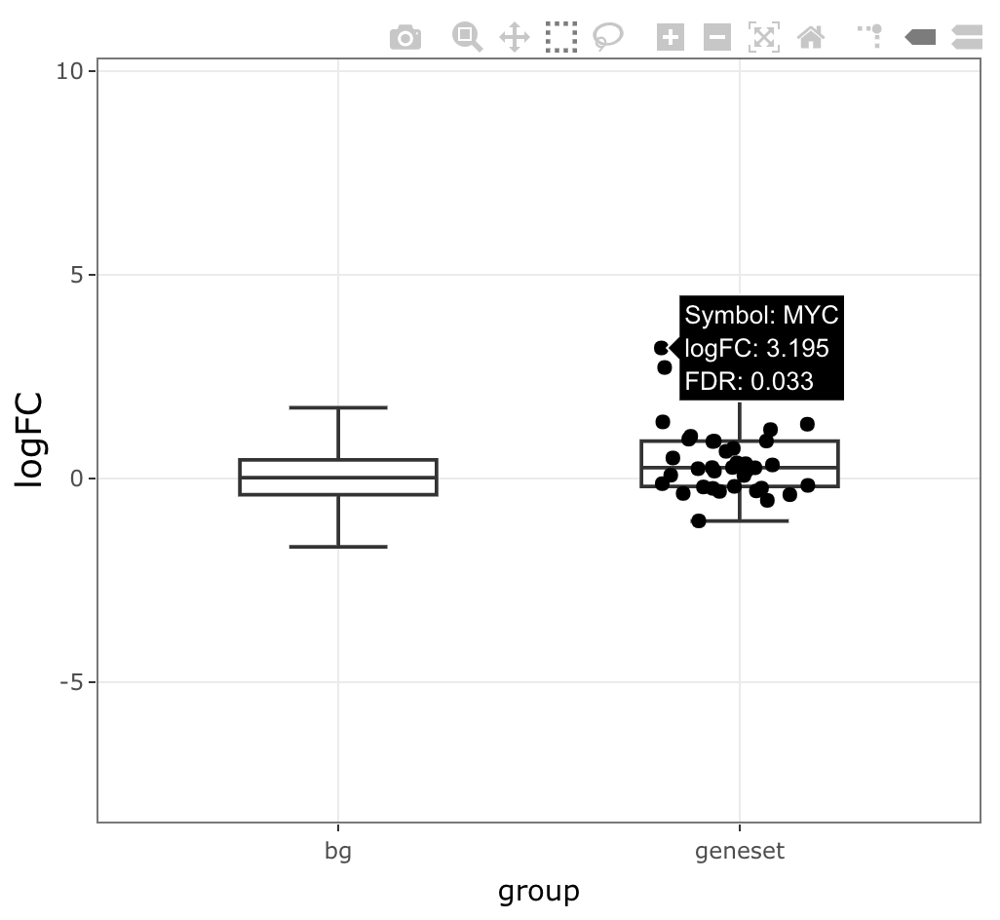
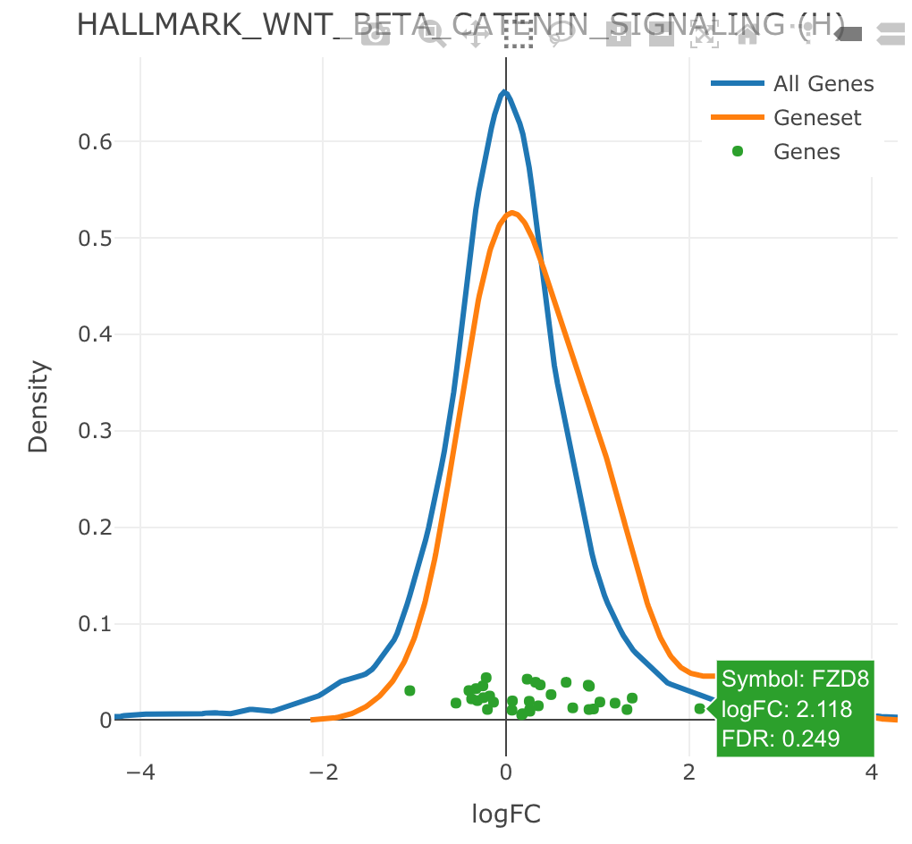
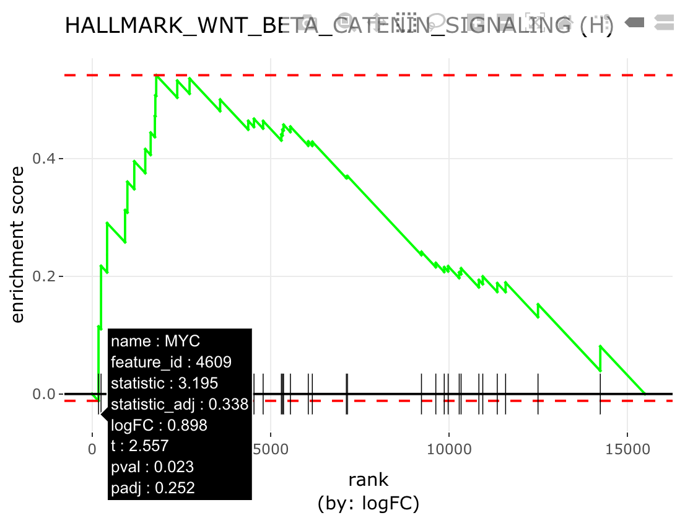
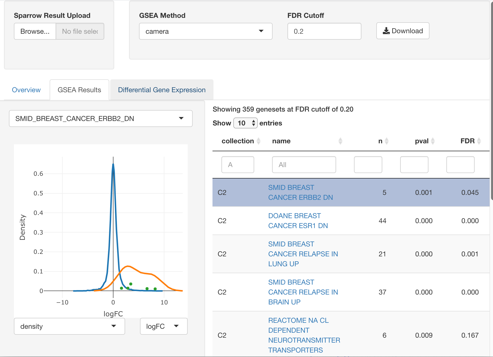

```{r init, include=FALSE, echo=FALSE, message=FALSE, warning=FALSE}
knitr::opts_chunk$set(
  echo=TRUE, warning=FALSE, message=FALSE, error=FALSE) #, dpi=150)

# TODO:
# 1. update text to favor overrepresentation analysis method `ora`
# 2. describe how its data.frame input works (ora)
# 3. provide a brief comparison to its performance vs goseq, with and without
#    accounting for bias). You can take the code for that from the
#    enrichtest/goseq PAC unit test.
```

# Overview

The `{sparrow}` package was built to facilitate the use of gene sets in the
analysis of high throughput genomics data (primarily RNA-seq). It does so
by providing these top-line functionalities:

* The `seas` function is a wrapper that orchestrates the execution of any
  number of user-specified gene set enrichment analyses (GSEA) over a particular
  experimental contrast of interest. This will create a `SparrowResult`
  object which stores the results of each GSEA method internally, allowing
  for easy query and retrieval.
* A sister [`{sparrow.shiny}`][sparrowshiny] package provides an `explore`
  function, which is invoked on `SparrowResult` objects returned from a call to
  `seas`. The shiny application facilitates interactive exploration of these
  GSEA results. This application can also be deployed to a shiny server and can
  be initialized by uploading a serialized `SparrowResult` `*.rds` file.
* An "over representation analysis" method `ora()` which wraps the biased
  enrichment functionality found within `limma::kegga` and generalizes it to
  work against data.frame inputs with arbitrary genesets.
* The `scoreSingleSamples` function is a wrapper that enables the user to
  generate single sample gene set scores using a variety of different
  single sample gene set scoring methods.
* Convenience gene set collection retrieval functions that return `BiocSet`s
  from widely used databases, like `getMSigCollection()` ([MSigDB][msigdb]),
  `getKeggCollection()` ([KEGG][KEGG]), `getPantherCollection()`
  ([PANTHER database](pantherdb)), and `getReactomeCollection()`
  ([Reactome][reactome]) with support for different organisms and identifier
  types (partially).

The initial GSEA methods that sparrow wrapped were the ones provided by limma
and edgeR. As such, many analyses using sparrow expect you to re-use the same
data objects used for differential expression analysis, namely:

* Expression data (an `EList`, `DGEList`, or expression matrix)
* A design matrix
* A contrast vector/matrix (if your design and comparison require it)

Other methods only require the user to provide a ranked vector of statistics
that represent some differential expression statistic per gene, and the GSEA is
performed by analyzing the ranks of genes within this vector.

The user can invoke one `seas()` call that can orchestrate multiple analyses
of any type.

Currently supported gene set enrichment methods include:

```{r sparrow-methods, echo=FALSE, message=FALSE, warning=FALSE}
dplyr::select(sparrow::sparrow_methods(), method, test_type, package)
```

When using these methods in analyses that lead to publication, please cite
the original papers that developed these methods and cite sparrow when its
functionality assisted in your interpretation and analysis.

The sparrow package provides a small example expression dataset extracted from
the TCGA BRCA dataset, which is available via the `exampleExpressionSet`
function. In this vignette we will explore differential expression and gene
set enrichment analysis by examining differences between basal and her2 PAM50
subtypes.

# Standard Workflow

Let's begin by setting up our work environment for exploratory analysis using
the sparrow package.

```{r init-env, warning=FALSE, message=FALSE}
library(sparrow)
library(magrittr)
library(dplyr)
library(ggplot2)
library(ComplexHeatmap)
library(circlize)
library(edgeR)
library(data.table)
theme_set(theme_bw())
```

<div class="note">
Internally, sparrow leverages the
[data.table](https://CRAN.R-project.org/package=data.table) package for fast
indexing and manipulation over data.frames. All functions that return
data.frame looking objects back have converted it from an data.table prior
to return. All such functions take an `as.dt` argument, which is set to `FALSE`
by default that controls this behavior. If you want `{sparrow}` to return a
data.table back to you from some function, try adding an `as.dt = TRUE` argument
to the end of the function call.
</div>

## Data Setup

sparrow is most straightforward to use when our data objects and analysis are
performed with either the edgeR or voom/limma pipelines and when we use standard
gene identifiers (like esnemble) as `rownames()` to these objects.

The `exampleExpressionSet` function gives us just such an object. We call it
below in a manner that gives us an object that allows us to explore expression
differences between different subtypes of breast cancer.

```{r data-setup, eval=!exists('y.all'), results='hide'}
vm <- exampleExpressionSet(dataset = "tumor-subtype", do.voom = TRUE)
```

Below you'll find the `$targets` data.frame of the voomed `EList`

```{r}
vm$targets %>%
  select(Patient_ID, Cancer_Status, PAM50subtype)
```

<div class="note">
Note that there are many tutorials online that outline how to generate expression matrices
for use with differential expression and analysis, such as the one that is returned from
the `exampleExpressionSet` function. Summarizing assay data into such a format is out
of scope for this vignette, but you can reference the
[airway vignette](http://bioconductor.org/packages/release/data/experiment/vignettes/airway/inst/doc/airway.html)
for full details (among others).
</div>

## Data Analysis

We will identify the genes and genesets that are differentially expressed
between the basal and her2 subtypes. The `vm` object has already been `voom`d
using this design:

```{r}
vm$design
```

We can test for differences between basla and her2 subtypes using the following
contrast:

```{r contrast-setup}
(cm <- makeContrasts(BvH=Basal - Her2, levels=vm$design))
```

### Differential Gene Expression

In this section, we first show you the straightforward analysis you would do
if you were only testing for differential gene expression.

With the data we have at hand, you would simply do the following:

```{r dge-analysis}
fit <- lmFit(vm, vm$design) %>%
  contrasts.fit(cm) %>%
  eBayes
tt <- topTable(fit, 'BvH', n=Inf, sort.by='none')
```

### Gene Set Enrichment Analysis

Given that we now have all of the pieces of data required for a differential
expression analysis, performing GSEA is trivial using the `seas` wrapper
function. We simply need to now define (1) the battery of gene sets we want to
test against, and (2) the GSEA methods we want to explore.

### Gene Sets to Test

The *sparrow* package provides a `GeneSetDb` class to store collections of 
gene sets. The `GeneSetDb` object is used heavily for the internal functionality
of `{sparrow}`, however you can provide sparrow with collections of gene sets
using other containers from the bioconductor universe, like a `BiocSet::BiocSet`
or a `GSEABase::GeneSetCollection`. This package provides convenience methods
to convert between these different types of gene set containers. Please refer
to *[The GeneSetDb Class](#the-genesetdb-class)* section for more details.

The {sparrow} package also provides convenience methods to retrieve gene set
collections from different sourckes, like [MSigDB][msigdb],
[PANTHER][pantherdb], [KEGG][], etc. These methods are named using the following
pattern: `get<CollectionName>Collection()` to return a `BiocSet` with the 
gene sets from the collection, or `get<CollectionName>GeneSetDb()` to get
a `GeneSetDb` of the same.

We'll use the `getMSigGeneSetDb` convenience function provided by the
*sparrow* package to load the [hallmark][hallmark] (`"h"`) and
[c2 (curated)][c2] (`"c2"`) gene set collections from [MSigDB][msigdb].

```{r build-gdb}
gdb <- getMSigGeneSetDb(c("h", "c2"), "human", id.type = "entrez")
```

:::note
To retrieve a `BiocSet` of these same collections, you could do:

```r
bsc <- getMSigCollection(c("h", "c2"), "human", id.type = "entrez")
```
:::

You can view a table of the gene sets defined inside a `GeneSetDb` (`gdb`)object
via its `geneSets(gdb)` accessor:

```{r geneSets-accessor}
geneSets(gdb) %>%
  head %>%
  select(1:4)
```

## Running sparrow

Performing multiple gene set enrichment analyses over your contrast of interest
simply requires you to provide a `GeneSetDb` (or `BiocSet`) object along with
your data and an enumeration of the methods you want to use in your analysis.

The call to `seas()` will perform these analyses and return a
`SparrowResult` object which you can then use for downstream analysis.

```{r run-multi-GSEA, results='hide', warning=FALSE}
mg <- seas(
  vm, gdb, c('camera', 'fry', 'ora'),
  design = vm$design, contrast = cm[, 'BvH'],
  # these parameters define which genes are differentially expressed
  feature.max.padj = 0.05, feature.min.logFC = 1,
  # for camera:
  inter.gene.cor = 0.01,
  # specifies the numeric covariate to bias-correct for
  # "size" is found in the vm$genes data.frame, which makes its way to the
  # internal DGE statistics table ... more on that later
  feature.bias = "size")
```

We will unpack the details of the `seas()` call shortly ...

## Implicit Differential Expression

First, let's note that in addition to running a plethora of GSEA's over our data
we've also run a standard differential expression analysis. If you've passed
a `matrix`, `ExpressionSet` or `EList` into `seas()`, a *limma*-based
`lmFit  %>% (eBayes|treat) %>% (topTable|topTreat)` pipeline was run. If a
`DGEList` was passed, then `seas` utilizes the *edgeR*-based
`glmQLFit %>% (glmQLFTest | glmTreat) %>% topTags` pipeline.

The result of the internally run differential expression analysis is accessible
via a call to `logFC` function on the `SparrowResult` object:

```{r logFC-results}
lfc <- logFC(mg)
lfc %>%
  select(symbol, entrez_id, logFC, t, pval, padj) %>%
  head
```

We can confirm that the statistics generated internally in `seas()` mimic our
explicit analysis above by verifying that the t-statistics generated by both
approaches are identical.

```{r compare-dge-t-stats}
comp <- tt %>%
  select(entrez_id, logFC, t, pval=P.Value, padj=adj.P.Val) %>%
  inner_join(lfc, by='entrez_id', suffix=c('.tt', '.mg'))
all.equal(comp$t.tt, comp$t.mg)
```

The internally performed differential expression analysis within the `seas()`
call can be customized almost as extensively as an explicitly performed analysis
that you would run using limma or edgeR by sending more parameters through
`seas()`'s `...` argument.

See the
*[Custom Differential Expression](#custom-differential-expression)*
section further in the vignette as well as the help available in
`?calculateIndividualLogFC` (which is called inside the `seas()` function)
for more information.

## Explicit GSEA

We also have the results of all the GSEA analyses that we specified to our
`seas` call via the `methods` parameter.

```{r mg-res}
mg
```

The table above enumerates the different GSEA methods run over each geneset
collection in the rows. The columns enumerate the number of genesets that the
collection has in total (`geneset_count`), and how many were found significant
at a given FDR, which is set to 20% by default. The `show` command for the
`SparrowResult` object simply calls the `tabulateResults()` function, which
you can call directly with the value of `max.p` that you might find more
appropriate.

## Exploring Results

GSEA results can be examined interactively via the command line, or via a shiny
application. You can use the `resultNames` function to find out what GSEA
methods were run, and therefore available to you, within the the
`SparrowResult` object:

```{r resultnames}
resultNames(mg)
```

Note that when running an "over representation analysis" `"ora"` (or `"goseq"`),
it will be run three different ways. The tests will be run first by testing
all differentially expressed genes that meet a given set of min logFC and
max FDR thresholds,  then separately for only genes that go up in your contrast,
and a third time for only the genes that go down.

The individual gene set statistics generated by each method are available via
the `result` function (or several can be returned with `results`):

```{r gsea-res}
cam.res <- result(mg, 'camera')
cam.go.res <- results(mg, c('camera', 'ora.up'))
```

You can identify genesets with the strongest enrichment by filtering and sorting
against the appropriate columns. We can, for instance, identify which hallmark
gene sets show the strongest enrichment as follows:

```{r camera-summary}
cam.res %>%
  filter(padj < 0.1, collection == 'H') %>%
  arrange(desc(mean.logFC)) %>%
  select(name, n, mean.logFC, padj) %>%
  head
```

You can also list the members of a geneset and their individual differential
expression statistics for the contrast under test using the `geneSet` function.

```{r geneset-result}
geneSet(mg, name = 'HALLMARK_WNT_BETA_CATENIN_SIGNALING') %>%
  select(symbol, entrez_id, logFC, pval, padj) %>% 
  head()
```

<div class="note">
The results provided in the table generated from a call to `geneSet` are
independant of GSEA method. The statistics appended to the gene set members
are simply the ones generated from a differential expression analysis.
</div>

## Plotting

`{sparrow}` provides a number of interactive plotting facilities to explore the
enrichment of a single geneset under the given contrast. In the boxplots and
density plots shown below, the log fold changes (logFCs) (or t-statistics) for
all genes under the contrast are visualized in the "background" set, and these
same values are shown for the desired geneset under the "geneset" group.

The logFC (or t-statistics) of the genes in the gene set are plotted as points,
which allow you to hover to identify the identity of the genes that land in
the regions of the distributions you care about.

<div class="note">
Including interactive plots increases the size of the vignette's by *a lot* and
will be rejected by the bioconductor build servers, so all plots included in
this vignette are static snapshots of the javascript enabled plots you would
normally get from `iplot()`.
</div>

**Boxplot**

```{r iplot-wnt-beta, fig.asp=1, eval=FALSE}
iplot(mg, 'HALLMARK_WNT_BETA_CATENIN_SIGNALING',
      type = 'boxplot', value = 'logFC')
```



**Density**

```{r iplot-wnt-beta-density, fig.asp=1, eval=FALSE}
iplot(mg, 'HALLMARK_WNT_BETA_CATENIN_SIGNALING',
      type = 'density', value = 'logFC')
```


**GSEA plot**

```{r iplot-wnt-beta-gsea, fig.asp=1, eval=FALSE, message=FALSE, warning=FALSE}
iplot(mg, 'HALLMARK_WNT_BETA_CATENIN_SIGNALING',
      type = 'gsea', value = 'logFC')
```



### Interactive Exploration

A sister [`{sparrow.shiny}`][sparrowshiny] package is available that can be used
to interactively explore `SparrowResult` objects to help you try to make sense
of the enrichment hits you get (or not!). The application can be invoked as
follows:

```r
sparrow.shiny::explore(mg)
```



Please refer to the `"sparrow-shiny"` vignette in the 
[`{sparrow.shiny}`][sparrowshiny] package for documentation on the application's
use.

:::note
The `{sparrow.shiny}` package is currently only available to install from
GitHub, but will be available through Bioconductor soon.
:::

# Singe Sample Gene Set Scoring

It can be both convenient and effective to transform a gene-by-sample expression
matrix to a geneset-by-sample expression matrix. By doing so, so we can quickly
identify biological processes that are up/down regulated (loosely speaking) in
each sample.

We can generate single sample gene set scores using the gene sets defined in a
`GeneSetDb` using the `scoreSingleSamples` function. This function takes a
`GeneSetDb`, an expression container, and a `methods` argument, which is
analagous to the `methods` argument in the `seas()` call: it defines
all of the scoring methos the user wants to apply to each sample.


Let's pick a few gene sets to score our samples with for this exercise. We'll
take the significant hallmark gene sets, or any other significant gene set that
has a large (on average) log fold change between conditions.

```{r ssgenesets}
sig.res <- cam.res %>%
  filter(padj < 0.05 & (grepl("HALLMARK", name) | abs(mean.logFC) >= 2))
gdb.sub <- gdb[geneSets(gdb)$name %in% sig.res$name]
```

<div class="note">
Refer to the [Subsetting a GeneSetDb](#subsetting-a-genesetdb) section to
learn how to subset a `GeneSetDb` object to create a derivative object with
fewer gene sets.
</div>

Recall that the GSEA analysis we performed was perfomed between the Basal and
Her2 subtypes, so we will use an expression matrix that only has the samples
from those two groups.

```{r subset-exprs}
vm.bh <- vm[, vm$targets$PAM50subtype %in% c("Basal", "Her2")]
```

## Generating Single Sample Gene Set Scores

Once we have a `GeneSetDb` object that contains all of the gene sets we wish
to use to create single sample gene set scores, we can use the
`scoreSingleSamples` function to produce these scores using a variety of
algorithmes, which the user species using the `methods` parameter.

The `scoreSingleSamples` function will return a long `data.frame` with
`length(methods) * ncol(exprs)` rows. Each row represents the score for the
given `sample` using the specified `method`. You can subset against the `method`
column to extract all of the single sample scores for a given method.

```{r ssscore, warning=FALSE}
scores <- scoreSingleSamples(gdb.sub, vm.bh,
                             methods = c('ewm', 'ssgsea', 'zscore'),
                             ssgsea.norm = TRUE, unscale=FALSE, uncenter=FALSE,
                             as.dt = TRUE)
```

We can see how the scores from different methods compare to each other:

```{r sss-pairs, warning=FALSE}
# We miss you, reshape2::acast
sw <- dcast(scores, name + sample_id ~ method, value.var="score")
corplot(sw[, -(1:2), with = FALSE], cluster=TRUE)
```

It is, perhaps, interesting to compare how the `ewm` method scores change when
we choose not to "uncenter" and "unscale" them:

```{r, warning=FALSE}
ewmu <- scoreSingleSamples(gdb.sub, vm.bh,methods = "ewm",
                           unscale = TRUE, uncenter = TRUE, as.dt = TRUE)
ewmu[, method := "ewm_unscale"]
scores.all <- rbind(scores, ewmu)
swa <- dcast(scores.all, name + sample_id ~ method, value.var="score")
corplot(swa[, -(1:2), with = FALSE], cluster=TRUE)
```

Further exposition on the "ewm" (eigenWeightedMean) scoring method can be
found in the `?eigenWeightedMean` function.

## Visualizing Single Sample Gene Set Scores

The "long" data.frame nature of the results produced by `scoreSingleSamples`
makes it convenient to use with graphing libraries like ggplot2 so that we can
create arbitrary visualizations. Creating boxplots for gene sets per subtype
is an easy way to explore these results.

Let's annotate each row in `scores.all` with the subtype annotation and observe
how these methods score each sample for a few gene sets.

```{r anno-scores}
all.scores <- scores.all %>%
  inner_join(select(vm.bh$targets, sample_id=Sample_ID, subtype=PAM50subtype),
             by = "sample_id")

some.scores <- all.scores %>%
  filter(name %in% head(unique(all.scores$name), 5))

ggplot(some.scores, aes(subtype, score)) +
  geom_boxplot(outlier.shape=NA) +
  geom_jitter(width=0.25) +
  facet_grid(name ~ method)
```

# Gene Set Based Heatmap with mgheatmap

We often want to create expression based heatmaps that highlight the behavior of
gene sets across our samples. The `mgheatmap` function uses the
[ComplexHeatmap][cplxhmap] package to create two different types of heatmaps:

1. Gene based heatmaps, that split the genes (rows) based on their genesets
2. Single sample gene set based heatmaps, optionally split by gene set
   collection.

The `mgheatmap` function has a set of arguments that customize how the heatmap
is to be created (gene level vs. gene set level, whether to split it, etcv) and
will also use the `...` argument to pass any parameters down to the inner
`ComplexHeatmap::Heatmap` function call and customize its behavior. The
`mgheatmap` function returns a `ComplexHeatmap,Heatmap` object for plotting
or combining with other ComplexHeatmap heatmaps or annotations in order to
create arbitrarily complex/informative heatmap figures.

[cplxhmap]: http://bioconductor.org/packages/ComplexHeatmap

## Gene level based heatmap (from genesets)

You can plot a heatmap of the genes from a predefined set of gene sets by
providing the gene sets you want to visualize in a `GeneSetDb` object.

We'll create a new `GeneSetDb` object using the first two gene sets in `gdb.sub`
and draw a heatmap of their expression.

```{r gheatmap, fig.height=8, fig.width=4}
gs.sub <- geneSets(gdb.sub)
gdb.2 <- gdb.sub[geneSets(gdb.sub)$name %in% head(gs.sub$name, 2)]

col.anno <- HeatmapAnnotation(
  df = vm.bh$targets[, 'PAM50subtype', drop = FALSE],
  col = list(PAM50subtype = c(Basal = "gray", Her2 = "black")))

mgheatmap(vm.bh, gdb.2, aggregate.by = "none", split = TRUE,
          show_row_names = FALSE, show_column_names = FALSE,
          recenter = TRUE, top_annotation = col.anno, zlim = c(-3, 3))
```

## Gene set-based heatmap

You can often get a higher information:ink ratio by plotting heatmaps based
on single sample gene set scores as opposed to the genes that make up a
geneset.

Let's see what the simple 2-geneset version of the heatmap above looks like:

```{r gshm2, fig.height = 2.5, fig.width = 8}
mgheatmap(vm.bh, gdb.2, aggregate.by = "ewm", split = FALSE,
          show_row_names = TRUE, show_column_names = FALSE,
          top_annotation = col.anno)
```

Plotted in this way, we can now show the activity of a greater number of
genesets

```{r gshm-all, fig.height = 6, fig.width = 8}
mgheatmap(vm.bh, gdb.sub,
          aggregate.by = 'ewm', split=TRUE, recenter = TRUE,
          show_row_names=TRUE, show_column_names=FALSE,
          top_annotation=col.anno, zlim = c(-2.5, 2.5))
```

# The GeneSetDb Class

The GeneSetDb class was developed to address the internal needs of the sparrow
package for fast look up, subsetting, cross reference, etc. of a collection of
gene sets. At the time (~2015), it was developed because the classes used for
this purpose in the bioconductor ecosystem (a `GSEABase::GeneSetCollection`,
or a simple list of gene vectors) didn't cut the mustard.

More recently, bioc-core has developed a new class called a `BiocSet` that is
feature-rich and shares significant overlap with the features in the 
`sparrow::GeneSetDb` class. Although we can't quite replace the internals of
{sparrow} to use the `BiocSet` just yet, users are encouraged to provide
collections of gene sets in the form of a `BiocSet` everywhere {sparrow}
functions require gene set collections, like `seas()` and
`scoreSingleSamples()`. You can also convert a `sparrow::GeneSetDb()` to a
`BiocSet` via a simple call: `as(gdb, "BiocSet")`.


The remainder of this section provides a quick overview of the `GeneSetDb`
class.

The GeneSetDb object uses the `data.table` package internally for fast lookup.
Internally the collection of gene set information is minimally stored as a
three-column `data.table` in "long form", which has the following columns:

* collection
* name
* feature_id

More columns can be added to the internal `data.table` (a "symbol" column,
for instance), but those are the only three you need.

To see what we are talking about, exactly, you can call the `as.data.frame`
function on a `GeneSetDb` object:

```{r}
as.data.frame(gdb)[c(1:5, 201:205),]
```


The `(collection,name)` tuple is the primary key of a gene set. The `feature_id`
column stores gene identifiers. For the time being, it will be most natural
for these IDs to simply be ensembl gene identifiers (or entrez ids) as many of
the annotation databases use these identifiers, as well. In reality, you will
want the values in the `feature_id` columns to match with the feature id's
you have in your data container (ie. the `rownames()` of a
`SummarizedExperiment`, for instance).

## Building a GeneSetDb

The sparrow package provides convenience functions to fetch genesets from many
sources and convert them into a GeneSetDb object. The two most useful sources
may be:

* [MSigDB][msigdb] via `getMSigGeneSetDb(...)`. Although the core `sparrow`
  package provides the getter function for these genesets, the main data
  retrieval functionality is provided through the [msigdbr][] package.
* [PANTHER][pantherdb] (pathways and GOSLIM) via `getPantherGeneSetDb()`
* [KEGG][] via `getKeggGeneSetDb(...)`

We also provide similarly named methos to retrieve these gene set collections
as a `BiocSet`, just substitute `"Collection"` for `"GeneSetDb"`, ie.
`getMsigCollection(...)`, `getPantherCollection(...)`, and
`getKeggCollection(...)`.

You can create a custom `GeneSetDb` via the `GeneSetDb()` constructor, which
accepts the following types of inputs.

1. A `BiocSet`
2. A `GeneSetCollection`
3. A data.frame of geneset membership. This requires `collection`, `name`, and
   `feature_id` columns. Reference the output of `as.data.frame(gdb)` shown
   above.
4. A named list of gene identifier vectors that represent genesets for a
   single collection
5. A named list of (2)-like lists. The top level names are the names of the
   different collections, and each sublist represents the genesets in that
   collection.

Two `GeneSetDb` objects can be combined using the `cobine()` function. For now
it is your responsibility to ensure that the two `GeneSetDb` objects are
"reasonably conformable", ie. they use the same types of gene identifiers, and
are referencing the same species, etc.

```{r, eval=FALSE}
msigdb <- getMSigGeneSetDb('H', 'human')
goslimdb <- getPantherGeneSetDb('goslim', 'human')
gdb.uber <- combine(msigdb, goslimdb)
```

See the help and examples in `?GeneSetDb` for more information.

<div class="warning">

For some reason the `PANTHER.db` package needs to be installed in a
user-writable package location for this to work properly. If you see an error
that speaks to using "rsqlite to write to a readonly database", you will have to
re-install `PANTHER.db` in a user-writable directory using 
`BiocManager::install("PANTHER.db")`

</div>

## Subsetting a GeneSetDb

The subsetting functionality for a `GeneSetDb` is a bit clunky. We assume
you want to subset a GeneSetDb to include a subset of, well, gene sets.

One way you can do that is to provide a logical vector that is as long as there
are gene sets in the GeneSetDb as an index.

For instance, if we want to include only the genesets in [CP:PID][msigdbpid],
you can do that. This subcatory information is stored in the `"subcategory"`
column from `geneSets(gdb)`

```{r subset-gdb-by-metadata}
keep <- geneSets(gdb)$subcategory == "CP:PID"
gdb.sub <- gdb[keep]
geneSets(gdb.sub) %>% head()
```

You can also subset a `GeneSetDb` to only include gene sets that contain
certain features:

```{r subset-gdb}
gdb.sub2 <- subsetByFeatures(gdb, c('10014', '1454'))
nrow(gdb); nrow(gdb.sub2)
```

## Active vs Inactive Gene Sets

A `GeneSetDb` is used to hold "the universe" of genes that belong to different
gene sets across different collections. Depending on the assay performed to
measure these genes, the set of genes you observe in your study will likely
be a subset of the genes in the `GeneSetDb`. As such, prior to using a
`GeneSetDb` for GSEA, it must be "conformed" to a target object that will be
used for the input to the GESA (either a matrix of expression, or a pre ranked
vector of statistics). This step will index into the target expression object
and identify which rows of the object correspond to which genes in the
`GeneSetDb`.

"Conformation" happens automatically within the `seas()` call, but we call it
explicitly below to outline its functionality. The command below conforms
the `GeneSetDb` to our target "voomed" `EList`, and deactivates gene sets
(i.e. removes them from downstream GSEA) that have less than 10 or more than 100
genes that were found in `vm`:

```{r}
gdbc <- conform(gdb, vm, min.gs.size=10, max.gs.size=100)
head(geneSets(gdbc, active.only=FALSE))
```

We can see that, only 23 of the 26 genes in the
`(C2,ABBUD_LIF_SIGNALING_1_DN)` were found in the rows of `vm`, and the `(C2,ABBUD_LIF_SIGNALING_2_DN)` was "deactivated." Deactivated
(`active == FALSE`) gene sets will be ignored during downstream analyses. This
gene set was deactivated  because it only has five "conformed" genes, but the
minimum geneset size we wanted to consider (`min.gs.size`) was set to ten in
our call to `conform`.

## Accessing members of a gene set

The `geneSet` and `featureIds` functions allow the user to identify the genes
found in a gene set. Both of these functions take an `active.only` argument,
which is `TRUE` by default. This specifies that only the genes that have been
successfully conformed to a gene set should be the ones that are returned.

For instance, we can identify which genes belong to the
`(C2,ABBUD_LIF_SIGNALING_1_DN)`, and which three were not found in `vm` like so:

```{r}
missed <- setdiff(
  featureIds(gdbc, 'C2', 'ABBUD_LIF_SIGNALING_1_DN', active.only=FALSE),
  featureIds(gdbc, 'C2', 'ABBUD_LIF_SIGNALING_1_DN', active.only=TRUE))
missed
```

or we can use the `geneSet` function to return a `data.frame` of these results:

```{r}
gdbc %>%
  geneSet('C2', 'ABBUD_LIF_SIGNALING_1_DN', active.only = FALSE) %>%
  subset(feature_id %in% missed)
```

## Mapping of gene set featureIds to target expression containers

It may be that the IDs used in a gene set collection are different from the
ones used as the rownames of your expression container. For instance, the IDs
used for a given gene set collection in the `GeneSetDb` might be
Ensembl gene identifiers, but the rownames of the expression object might
be Entrez ID. This is where the `mapping` parameter becomes useful.

The `GeneSetDb` class has a concept of an internal `featureIdMap` to accommodate
these scenarios, which would allow for a non-destructive mapping of the original
IDs to a new "ID space" (entrez to ensembl, for instance).

This functionality is not ready for this release, but it's just a note to keep
the user aware of some future development of the package. For the
time being, the user is required to manually map the feautreIds in their
expression matrix to be concordant with the ones found in the `GeneSetDb`.

**In the meantime**, a `renameRows` convenience function is provided here
to easily rename the rows of our expression container to different values.
For instance, to rename this is how you might rename the rows of your assay
container to use symbols:

```{r}
vm <- exampleExpressionSet()
vms <- renameRows(vm, "symbol")
head(cbind(rownames(vm), rownames(vms)))
```

We grabbed the `symbol` column from `vm$genes` and "smartly" renamed the rows
of `vm` with the values there. Refer to the `?renameRows` man page for more
details. This, of course, still requires you to manually fetch and map
identifiers, but still ...

# Customizing Analyses

The internal differential expression analysis as well the gene set enrichment
analyses can be customized by passing parameters through the `...` in the
`seas()` function.

## Custom Differential Expression

The internal differential expression pipeline, exported via the
`calculateIndividualLogFC` function allows the end user to configure an
"arbitrarily complex" differential expression analysis using either edgeR's
quasilikelihood framework (if the input is a DGEList) or a direct limma
analysis (with a pre-voomed EList, expression matrix, or whatever).

User's should refer to the `?calculateIndividualLogFC` help page to see
which parameters are exposed for a differential expression analysis and
configure them accordingly. When calling `seas()` use these same parameters
in the call and they will be provided to `calculateIndividualLogFC`.

For instance, if you wanted to use limma's "treat" functionality to specify
a minimal log fold change threshold for statistical significance, you would do
so as follows:

```{r, eval=FALSE}
mg <- seas(vm, gdb, "goseq", design = vm$design, cm[, 'BvH'],
           treat.lfc=log2(1.5),
           ## feature length vector required for goseq
           feature.bias=setNames(vm$genes$size, rownames(vm)))
```

Using the internal `treat` functionality would really only affect enrichment
tests that first threshold the genes in your experiment as "significant" or not,
like `goseq` and not tests like `camera`.

## Custom GSEA

The GSEA methods that are wrapped by `seas()` all take the same parameters
that are defined by their implementation. Simply pass these parameters down
via the `...` in the `seas()` call.

For instance, you can read `?camera` to find that the `camera` method accepts an
`inter.gene.cor` parameter, and `?roast` will tell you that you can specify
the number of rotations used via the `nrot` parameter.

```{r, eval=FALSE}
mgx <- seas(vm, gdb, c('camera', 'roast'), 
            design = vm$design, contrast = cm[, 'BvH'],
            inter.gene.cor = 0.04, nrot = 500)
```

# Reproducibility

<details>
<summary>Session Information</summary>

```{r session-info}
sessionInfo()
```

</details>


[BiocSet]: http://bioconductor.org/packages/release/bioc/html/BiocSet.html
[msigdb]: http://software.broadinstitute.org/gsea/msigdb/
[msigdbr]: https://cran.r-project.org/package=msigdbr
[msigdbpid]: https://www.gsea-msigdb.org/gsea/msigdb/genesets.jsp?collection=CP:PID
[hallmark]: http://www.cell.com/cell-systems/abstract/S2405-4712(15)00218-5
[isigdb]: http://www.cell.com/immunity/abstract/S1074-7613(15)00532-4
[c2]: http://software.broadinstitute.org/gsea/msigdb/collections.jsp#C2
[c5]: http://software.broadinstitute.org/gsea/msigdb/collections.jsp#C5
[c7]: http://software.broadinstitute.org/gsea/msigdb/collections.jsp#C7
[KEGG]: https://www.genome.jp/kegg/
[pantherdb]: http://pantherdb.org
[reactome]: https://reactome.org/
[pgoslim]: http://www.pantherdb.org/panther/ontologies.jsp
[sparrowshiny]: https://github.com/lianos/sparrow.shiny

